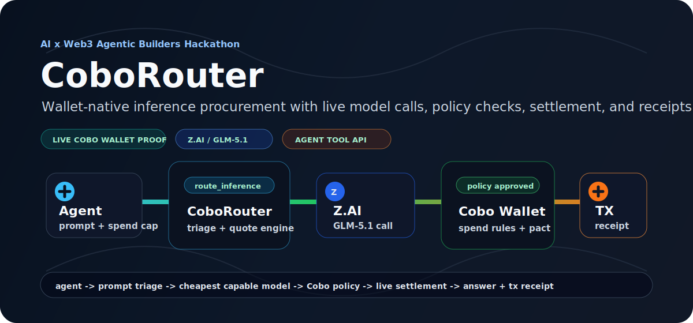
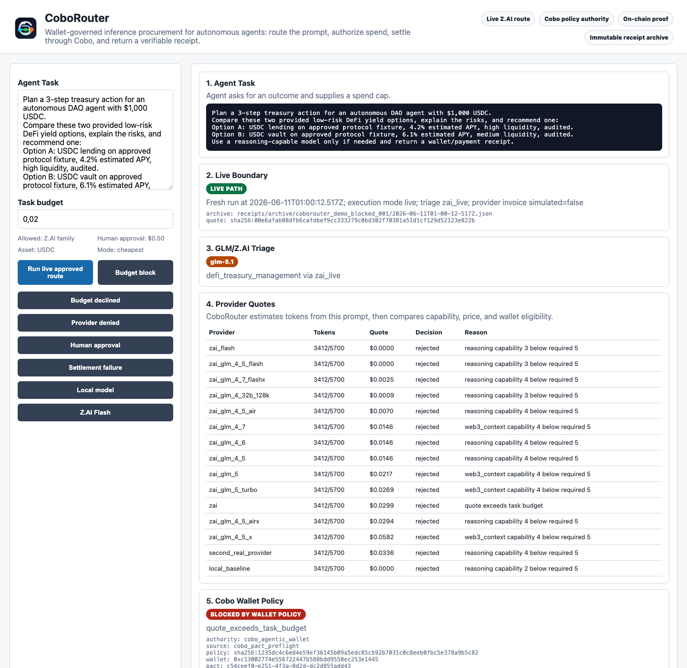
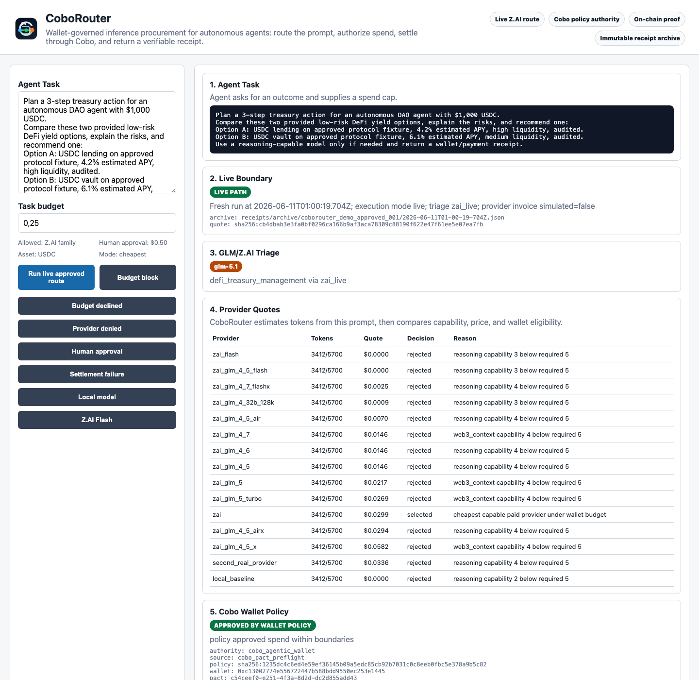
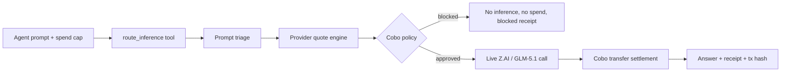

<div align="center">


# CoboRouter

### Wallet-governed inference procurement for autonomous agents

**CoboRouter lets autonomous agents safely buy intelligence. It combines model routing with wallet-native spend policy, so every inference purchase is governed, paid, and receipted.**

[](https://github.com/Augustas11/CoboRouter/actions/workflows/verify.yml)


<br />
<br />



</div>

---

## The 20-second version

CoboRouter is an **agentic resource procurement flow** for wallet-bound autonomous agents:

1. An agent sends a task prompt and spend cap.
2. CoboRouter scores the prompt and routes to the cheapest capable provider.
3. Cobo Agentic Wallet policy approves or blocks spend.
4. Approved jobs call live Z.AI / GLM-5.1.
5. CoboRouter settles a live Cobo wallet transaction.
6. The agent receives the answer plus a cryptographic receipt.

Agents will need to spend money autonomously. Wallet policy without model-routing intelligence is too dumb; model routing without wallet-native controls is too unsafe. CoboRouter joins them.

## Verification path

| What to check | Where |
| --- | --- |
| Agent-compatible API | `GET /api/tool-schema` and `POST /api/route-inference` |
| Agent skill manifest | [`agent/coborouter.route_inference.tool.json`](agent/coborouter.route_inference.tool.json) |
| Blocked spend path | `npm run demo:blocked` and [`receipts/coborouter_demo_blocked_001.json`](receipts/coborouter_demo_blocked_001.json) |
| Approved paid path | `npm run demo:approved` and [`receipts/coborouter_demo_approved_001.json`](receipts/coborouter_demo_approved_001.json) |
| Edge-case routing | `npm run demo:budget-declined`, `npm run demo:local`, `npm run demo:zai-flash` |
| Safe failure modes | `npm run demo:provider-denied`, `npm run demo:human-approval`, `npm run demo:settlement-failure` |
| Receipt verifier | `npm run verify:receipt -- receipts/coborouter_demo_approved_001.json` |
| Agentic E2E proof | `npm run e2e:agent` expects `25 passed, 0 failed` |
| Wallet proof | Cobo operation `7406658f-973a-4fa7-8a62-4c072225c107` and Sepolia tx below |

## Product Hardening

Receipts now make the live boundary explicit. Each run records `receipt.execution_mode`, Z.AI invoice simulation status, Cobo policy authority/source, prompt-derived token estimates, and an immutable archive path under `receipts/archive/...`.

The demo API also includes submission-grade guardrails: bounded request bodies, bounded prompt length, per-client rate limiting, and idempotency-key conflict detection for replay safety.

For live judging, run `npm run dev`, open `http://localhost:4173`, and click **Run live approved route**. The timeline shows `Agent Task -> Z.AI Triage -> Provider Quotes -> Cobo Policy -> Payment/Block -> Inference -> Receipt`, then links the fresh Cobo tx proof from the receipt panel.

## Live proof

This repo includes receipts from a live end-to-end run.

| Proof | Value |
| --- | --- |
| Prompt triage | `zai_live` using `glm-5.1` |
| Selected model | `zai / glm-5.1` |
| Z.AI provider invoice | `provider_invoice.simulated=false` |
| Cobo policy / pact | `c54ceef0-e251-4f3a-8d2d-dc2d855add43` |
| Agent wallet | `0xc13002774e556722447b588bdd9550ec253e1445` |
| Cobo operation | `7406658f-973a-4fa7-8a62-4c072225c107` |
| On-chain tx | [`0xe90621cec8fcfd0cb6311aa3f61e2cbaa65c5e45afc5ff4a570487834fbe998b`](https://sepolia.etherscan.io/tx/0xe90621cec8fcfd0cb6311aa3f61e2cbaa65c5e45afc5ff4a570487834fbe998b) |
| Receipt | [`receipts/coborouter_demo_approved_001.json`](receipts/coborouter_demo_approved_001.json) |

## Edge cases

CoboRouter handles successful procurement, wallet-policy denial, local execution, and lightweight model routing. The repo includes receipts for routes where the broker chooses not to spend, or chooses a cheaper/local model.

| Scenario | Command | Expected proof |
| --- | --- | --- |
| Wallet policy declines overspend | `npm run demo:budget-declined` | `wallet_policy.reason=quote_exceeds_task_budget`, `payment.status=not_created` |
| Provider is not allowlisted | `npm run demo:provider-denied` | `wallet_policy.reason=provider_not_allowlisted`, no inference |
| Human approval is required | `npm run demo:human-approval` | `wallet_policy.result=requires_human_approval`, no payment |
| Settlement fails safely | `npm run demo:settlement-failure` | `status=paid_failed`, no provider call, reconciliation receipt |
| Private/local prompt stays local | `npm run demo:local` | `selected_provider=local_baseline`, `selected_model=local-small`, no provider payment |
| Simple prompt uses lighter Z.AI model | `npm run demo:zai-flash` | `selected_provider=zai_flash`, `selected_model=glm-4.7-flash`, `provider_invoice.simulated=false` with `ZAI_API_KEY` |

Receipts:

- [`receipts/coborouter_edge_budget_declined_001.json`](receipts/coborouter_edge_budget_declined_001.json)
- [`receipts/coborouter_edge_provider_not_allowlisted_001.json`](receipts/coborouter_edge_provider_not_allowlisted_001.json)
- [`receipts/coborouter_edge_human_approval_001.json`](receipts/coborouter_edge_human_approval_001.json)
- [`receipts/coborouter_edge_settlement_failure_001.json`](receipts/coborouter_edge_settlement_failure_001.json)
- [`receipts/coborouter_edge_local_001.json`](receipts/coborouter_edge_local_001.json)
- [`receipts/coborouter_edge_zai_flash_001.json`](receipts/coborouter_edge_zai_flash_001.json)

## Z.AI Model Coverage

CoboRouter can quote and route prompt execution across the Z.AI chat-completion language-model family:

| Tier | Models |
| --- | --- |
| Flagship agent reasoning | `glm-5.1`, `glm-5-turbo`, `glm-5` |
| Agent/coding reasoning | `glm-4.7`, `glm-4.6`, `glm-4.5`, `glm-4.5-x` |
| Lightweight / faster routes | `glm-4.7-flash`, `glm-4.7-flashx`, `glm-4.5-air`, `glm-4.5-airx`, `glm-4.5-flash` |
| Long-context baseline | `glm-4-32b-0414-128k` |

Routing uses the same quote table for every model: capability fit, estimated cost, latency, wallet-payment requirement, and provider allowlist.

## Demo screens

| Wallet policy blocks overspend | Approved route settles on-chain |
| --- | --- |
|  |  |

## What makes it different

Most LLM routers answer: **Which model should I call?**

CoboRouter answers: **Can this autonomous agent procure this inference under wallet policy, pay for it safely, and prove what happened?**

| Generic router | CoboRouter |
| --- | --- |
| API-key centric | Wallet-policy centric |
| Chooses model only | Chooses, authorizes, pays, and receipts |
| No spend boundary | Per-task cap, allowlist, daily cap, human-approval threshold |
| No wallet proof | Cobo operation + Sepolia transaction proof |
| Hard to audit | Prompt hash, quote ID, route trace, provider invoice, tx hash |

## Architecture



## Agent API

Any agentic runtime can use CoboRouter as a tool over HTTP. The repo includes a portable tool manifest at [`agent/coborouter.route_inference.tool.json`](agent/coborouter.route_inference.tool.json), or agents can discover the live schema from the running server.

Clone and start the tool:

```bash
git clone https://github.com/Augustas11/CoboRouter.git
cd CoboRouter
npm install
npm run dev
```

```bash
curl http://localhost:4173/api/tool-schema
```

```bash
curl -X POST http://localhost:4173/api/route-inference \
  -H "content-type: application/json" \
  -d '{
    "prompt": "Plan a 3-step treasury action for an autonomous DAO agent with $1,000 USDC.",
    "routing_mode": "cheapest_capable",
    "max_spend_usd": 0.25,
    "allowed_providers": ["zai"],
    "require_receipt": true,
    "scenario": "approved"
  }'
```

Expected result:

- `broker_decision.triage_source = "zai_live"`
- `broker_decision.selected_provider = "zai"`
- `broker_decision.selected_model = "glm-5.1"`
- `wallet_policy.result = "approved"`
- `provider_invoice.simulated = false` with live Z.AI keys
- `payment.proof_type = "on_chain"`
- `payment.tx_hash` points to Sepolia

## Run locally

```bash
npm install
npm run dev
```

Open:

```text
http://localhost:4173
```

Run the core and edge paths:

```bash
npm run demo:blocked
npm run demo:approved
npm run demo:budget-declined
npm run demo:provider-denied
npm run demo:human-approval
npm run demo:settlement-failure
npm run demo:local
npm run demo:zai-flash
```

Verify a tamper-evident receipt:

```bash
npm run verify:receipt -- receipts/coborouter_demo_approved_001.json
```

Run the agent-style E2E:

```bash
npm run e2e:agent
```

The E2E test starts the server, discovers the tool schema, calls `POST /api/route-inference`, verifies the blocked no-spend path, verifies the approved path returns Cobo proof, and checks safe failures for allowlist denial, human approval, and settlement failure.

Latest live E2E result:

```text
PASS tool schema is discoverable
PASS blocked path creates no payment
PASS approved path selects wallet-paid provider: provider=zai
PASS approved path uses live Z.AI triage when key is configured: triage=zai_live
PASS approved path selects GLM-5.1: model=glm-5.1
PASS approved path uses real Z.AI invoice: simulated=false
PASS transfer settlement returns on-chain proof: status=settled tx=0xe90621...
PASS budget edge blocks because quote exceeds wallet budget
PASS local edge selects local model
PASS simple Z.AI edge selects non-GLM-5.1 model
PASS provider allowlist blocks selected provider
PASS human approval pauses before spend
PASS settlement failure skips inference
Agent E2E summary: 25 passed, 0 failed.
```

## Live mode

Copy the template and fill local-only credentials:

```bash
cp .env.example .env
```

Required live values:

```text
COBO_ADAPTER_MODE=live
AGENT_WALLET_API_URL=https://api.agenticwallet.cobo.com
AGENT_WALLET_API_KEY=
AGENT_WALLET_WALLET_ID=
COBO_POLICY_ID=
COBO_WALLET_ADDRESS=
COBO_SETTLEMENT_MODE=transfer
COBO_PROVIDER_SETTLEMENT_ADDRESS=
COBO_SETTLEMENT_TOKEN_ID=SETH
COBO_SETTLEMENT_CHAIN_ID=SETH
COBO_SETTLEMENT_AMOUNT=0.0001
COBO_EXPLORER_TX_BASE_URL=https://sepolia.etherscan.io/tx
ZAI_API_KEY=
ZAI_MODEL=glm-5.1
```

Check live readiness:

```bash
npm run check:live
```

## Receipt shape

The receipt is designed for operators and agents to audit quickly.

```json
{
  "broker_decision": {
    "triage_source": "zai_live",
    "selected_provider": "zai",
    "selected_model": "glm-5.1",
    "quote_hash": "sha256:...",
    "reason": "cheapest capable paid provider under wallet budget"
  },
  "wallet_policy": {
    "result": "approved",
    "policyId": "c54ceef0-e251-4f3a-8d2d-dc2d855add43"
  },
  "payment": {
    "wallet_provider": "cobo_agentic_wallet",
    "proof_type": "on_chain",
    "status": "settled",
    "tx_hash": "0xe90621cec8fcfd0cb6311aa3f61e2cbaa65c5e45afc5ff4a570487834fbe998b"
  },
  "provider_invoice": {
    "simulated": false
  },
  "receipt": {
    "route_trace_hash": "sha256:...",
    "quote_hash": "sha256:..."
  }
}
```

## Key files

| File | Why it matters |
| --- | --- |
| [`src/broker/routeInference.ts`](src/broker/routeInference.ts) | End-to-end orchestration: triage, route, wallet check, inference, receipt |
| [`agent/coborouter.route_inference.tool.json`](agent/coborouter.route_inference.tool.json) | Portable agent tool manifest for `route_inference` |
| [`src/wallet/coboAdapter.ts`](src/wallet/coboAdapter.ts) | Cobo Agentic Wallet policy + transfer settlement adapter |
| [`src/triage/zaiTriage.ts`](src/triage/zaiTriage.ts) | GLM/Z.AI prompt triage with cached fallback |
| [`src/inference/inferenceAdapter.ts`](src/inference/inferenceAdapter.ts) | Live provider execution and invoice boundary |
| [`src/demo/e2eAgentClient.ts`](src/demo/e2eAgentClient.ts) | External agent-style HTTP proof |
| [`src/demo/verifyReceipt.ts`](src/demo/verifyReceipt.ts) | Offline receipt hash and proof verifier |
| [`src/demo/timelineUi.tsx`](src/demo/timelineUi.tsx) | Timeline UI for inspecting routing, wallet policy, settlement, and receipt state |
| [`receipts/coborouter_demo_approved_001.json`](receipts/coborouter_demo_approved_001.json) | Live approved receipt |
| [`receipts/coborouter_demo_blocked_001.json`](receipts/coborouter_demo_blocked_001.json) | Blocked no-spend receipt |
| [`receipts/coborouter_edge_budget_declined_001.json`](receipts/coborouter_edge_budget_declined_001.json) | Explicit budget-declined receipt |
| [`receipts/coborouter_edge_provider_not_allowlisted_001.json`](receipts/coborouter_edge_provider_not_allowlisted_001.json) | Provider allowlist denial receipt |
| [`receipts/coborouter_edge_human_approval_001.json`](receipts/coborouter_edge_human_approval_001.json) | Human approval required receipt |
| [`receipts/coborouter_edge_settlement_failure_001.json`](receipts/coborouter_edge_settlement_failure_001.json) | Settlement failure recovery receipt |
| [`receipts/coborouter_edge_local_001.json`](receipts/coborouter_edge_local_001.json) | Local model route receipt |
| [`receipts/coborouter_edge_zai_flash_001.json`](receipts/coborouter_edge_zai_flash_001.json) | Lightweight Z.AI model route receipt |

## Security boundaries

- No raw private keys in code.
- `.env` is ignored and never committed.
- Cobo Agentic Wallet owns policy enforcement.
- Unknown providers are denied by allowlist.
- Overspend attempts stop before inference.
- Transfer settlement uses tiny testnet SETH for proof.
- Every paid path produces a receipt with prompt hash, route trace, policy hash, provider invoice, and Cobo proof.
