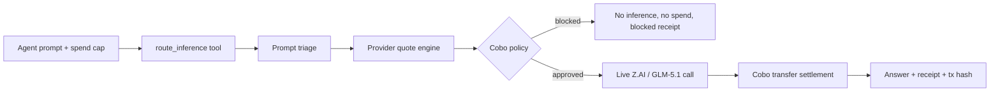

<div align="center">


# CoboRouter

### Wallet-governed inference procurement for autonomous agents

**CoboRouter lets autonomous agents safely buy intelligence. It combines model routing with wallet-native spend policy, so every inference purchase is governed, paid, and receipted.**

[](https://github.com/Augustas11/CoboRouter/actions/workflows/verify.yml)


<br />
<br />


</div>

---

## The 20-second version

CoboRouter is an **agentic resource procurement flow** for wallet-bound autonomous agents:

1. An agent sends a task prompt and spend cap.
2. CoboRouter scores the prompt and routes to the cheapest capable provider.
3. Cobo Agentic Wallet policy approves or blocks spend.
4. Approved jobs call live Z.AI / GLM-5.1.
5. CoboRouter settles a live Cobo wallet transaction.
6. The agent receives the answer plus a tamper-evident receipt.

Agents will need to spend money autonomously. Wallet policy without model-routing intelligence is too dumb; model routing without wallet-native controls is too unsafe. CoboRouter joins them.

## Use CoboRouter

Any agentic runtime can use CoboRouter as a tool over HTTP. The repo includes a portable tool manifest at [`agent/coborouter.route_inference.tool.json`](agent/coborouter.route_inference.tool.json), or agents can discover the live schema from the running server.

```bash
git clone https://github.com/Augustas11/CoboRouter.git
cd CoboRouter
npm install
npm run dev
```

Open the live product surface:

```text
http://localhost:4173
```

Click **Run live approved route** to watch the procurement timeline update:

```text
Agent Task -> Z.AI Triage -> Provider Quotes -> Cobo Policy -> Payment/Block -> Inference -> Receipt
```

Call it as an agent tool:

```bash
curl http://localhost:4173/api/tool-schema
```

Discover the current provider market:

```bash
curl http://localhost:4173/api/providers
```

```bash
curl -X POST http://localhost:4173/api/route-inference \
  -H "content-type: application/json" \
  -d '{
    "prompt": "Plan a 3-step treasury action for an autonomous DAO agent with $1,000 USDC.",
    "routing_mode": "cheapest_capable",
    "max_spend_usd": 0.25,
    "allowed_providers": ["zai"],
    "require_receipt": true,
    "idempotency_key": "agent-task-001"
  }'
```

Expected result:

- `broker_decision.triage_source = "zai_live"`
- `broker_decision.selected_provider = "zai"`
- `broker_decision.selected_model = "glm-5.1"`
- `wallet_policy.result = "approved"`
- `provider_invoice.simulated = false` with live Z.AI keys
- `payment.proof_type = "on_chain"`
- `payment.tx_hash` points to Sepolia

## Who Runs It

CoboRouter is deployed by an agent operator: a DAO treasury bot, trading agent team, automation platform, or agent wallet developer that wants autonomous inference spend to go through policy before provider execution.

The operator configures:

- Cobo Agentic Wallet credentials, policy ID, wallet address, and settlement address.
- Provider allowlist and price registry under [`src/inference/providerRegistry.json`](src/inference/providerRegistry.json).
- Optional `COBOROUTER_API_KEY` for agent access control.
- Z.AI API key for live GLM triage and execution.

Agents call only `route_inference`. They do not need provider keys, wallet keys, or settlement logic.

## What agents get

| Capability | What it means |
| --- | --- |
| Prompt triage | CoboRouter scores the task before choosing a model. |
| Provider procurement | The agent asks for an outcome; CoboRouter buys the right inference. |
| Wallet policy | Cobo Agentic Wallet approves, blocks, or pauses spend. |
| Live execution | Approved paid routes call Z.AI / GLM and settle through Cobo. |
| Receipts | Every route returns a prompt hash, quote hash, route trace, policy result, provider invoice, payment proof, and receipt hash. |

## Provider Discovery

`GET /api/providers` returns the model catalog that agents and operators can inspect before routing:

- provider ID and model name
- capability scores
- estimated input/output pricing
- latency and quality score
- wallet-payment requirement
- settlement mode
- pricing source and last update time
- dispute/refund policy

Pricing in this hackathon build is operator-controlled registry data. Live execution receipts still record the actual provider request/invoice reference and the Cobo payment operation, so a judge can distinguish quote estimates from execution evidence.

## Why it matters

Most LLM routers answer: **Which model should I call?**

CoboRouter answers: **Can this autonomous agent procure this inference under wallet policy, pay for it safely, and prove what happened?**

| Generic router | CoboRouter |
| --- | --- |
| API-key centric | Wallet-policy centric |
| Chooses model only | Chooses, authorizes, pays, and receipts |
| No spend boundary | Per-task cap, allowlist, daily cap, human-approval threshold |
| No wallet proof | Cobo operation + Sepolia transaction proof |
| Hard to audit | Prompt hash, quote ID, route trace, provider invoice, tx hash |

Compared with a simple wallet-gated API proxy, CoboRouter adds prompt triage, provider quotes, model selection, local/private routing, blocked-spend receipts, reconciliation status, and a verifier command for the receipt hash chain.

## Control Boundary

CoboRouter is explicit about which controls are wallet-native and which controls happen before wallet authorization.

| Layer | Enforced there |
| --- | --- |
| Cobo Agentic Wallet | Wallet identity, Cobo pact authorization, settlement operation, on-chain or Cobo operation proof |
| CoboRouter before wallet | Prompt triage, provider allowlist preflight, task budget preflight, human approval threshold preflight, idempotency/request bounds, receipt hash chain |
| Provider | API authentication, provider request ID, provider invoice/reference |
| Not CAW-enforced | Model quality scoring, estimated token quote, local/private route selection, provider answer quality |

Receipts include `control_boundary` so this is visible in every approved, blocked, local, and failed path.

## Architecture



## Live proof

This repo includes receipts from a live end-to-end run.

| Proof | Value |
| --- | --- |
| Prompt triage | `zai_live` using `glm-5.1` |
| Selected model | `zai / glm-5.1` |
| Z.AI provider invoice | `provider_invoice.simulated=false` |
| Cobo policy / pact | `c54ceef0-e251-4f3a-8d2d-dc2d855add43` |
| Agent wallet | `0xc13002774e556722447b588bdd9550ec253e1445` |
| Cobo operation | `7406658f-973a-4fa7-8a62-4c072225c107` |
| On-chain tx | [`0xe90621cec8fcfd0cb6311aa3f61e2cbaa65c5e45afc5ff4a570487834fbe998b`](https://sepolia.etherscan.io/tx/0xe90621cec8fcfd0cb6311aa3f61e2cbaa65c5e45afc5ff4a570487834fbe998b) |
| Receipt | [`receipts/coborouter_demo_approved_001.json`](receipts/coborouter_demo_approved_001.json) |

## Policy behavior

CoboRouter handles successful procurement, wallet-policy denial, local execution, and lightweight model routing. These are product behaviors: the agent can spend, get blocked, stay local, or pause for a human without leaving the wallet policy boundary.

| Scenario | Command | Expected proof |
| --- | --- | --- |
| Wallet policy declines overspend | `npm run demo:budget-declined` | `wallet_policy.reason=quote_exceeds_task_budget`, `payment.status=not_created` |
| Provider is not allowlisted | `npm run demo:provider-denied` | `wallet_policy.reason=provider_not_allowlisted`, no inference |
| Human approval is required | `npm run demo:human-approval` | `wallet_policy.result=requires_human_approval`, no payment |
| Settlement fails safely | `npm run demo:settlement-failure` | `status=paid_failed`, no provider call, reconciliation receipt |
| Private/local prompt stays local | `npm run demo:local` | `selected_provider=local_baseline`, `selected_model=local-small`, no provider payment |
| Simple prompt uses lighter Z.AI model | `npm run demo:zai-flash` | `selected_provider=zai_flash`, `selected_model=glm-4.7-flash`, `provider_invoice.simulated=false` with `ZAI_API_KEY` |

Receipts:

- [`receipts/coborouter_edge_budget_declined_001.json`](receipts/coborouter_edge_budget_declined_001.json)
- [`receipts/coborouter_edge_provider_not_allowlisted_001.json`](receipts/coborouter_edge_provider_not_allowlisted_001.json)
- [`receipts/coborouter_edge_human_approval_001.json`](receipts/coborouter_edge_human_approval_001.json)
- [`receipts/coborouter_edge_settlement_failure_001.json`](receipts/coborouter_edge_settlement_failure_001.json)
- [`receipts/coborouter_edge_local_001.json`](receipts/coborouter_edge_local_001.json)
- [`receipts/coborouter_edge_zai_flash_001.json`](receipts/coborouter_edge_zai_flash_001.json)

## Z.AI Model Coverage

CoboRouter can quote and route prompt execution across the Z.AI chat-completion language-model family:

| Tier | Models |
| --- | --- |
| Flagship agent reasoning | `glm-5.1`, `glm-5-turbo`, `glm-5` |
| Agent/coding reasoning | `glm-4.7`, `glm-4.6`, `glm-4.5`, `glm-4.5-x` |
| Lightweight / faster routes | `glm-4.7-flash`, `glm-4.7-flashx`, `glm-4.5-air`, `glm-4.5-airx`, `glm-4.5-flash` |
| Long-context baseline | `glm-4-32b-0414-128k` |

Routing uses the same quote table for every model: capability fit, estimated cost, latency, wallet-payment requirement, and provider allowlist.

## Demo screens

| Wallet policy blocks overspend | Approved route settles on-chain |
| --- | --- |
|  |  |

## Proof

Operators can verify the agent tool surface, wallet policy outcomes, payment proof, and receipt integrity from the repo.

| What to check | Where |
| --- | --- |
| Agent-compatible API | `GET /api/tool-schema` and `POST /api/route-inference` |
| Provider discovery API | `GET /api/providers` |
| Agent skill manifest | [`agent/coborouter.route_inference.tool.json`](agent/coborouter.route_inference.tool.json) |
| Blocked spend path | `npm run demo:blocked` and [`receipts/coborouter_demo_blocked_001.json`](receipts/coborouter_demo_blocked_001.json) |
| Approved paid path | `npm run demo:approved` and [`receipts/coborouter_demo_approved_001.json`](receipts/coborouter_demo_approved_001.json) |
| Policy behavior | `npm run demo:budget-declined`, `npm run demo:provider-denied`, `npm run demo:human-approval`, `npm run demo:settlement-failure` |
| Routing behavior | `npm run demo:local`, `npm run demo:zai-flash` |
| Receipt verifier | `npm run verify:receipt -- receipts/coborouter_demo_approved_001.json` |
| Agentic E2E proof | `npm run e2e:agent` expects `25 passed, 0 failed` |
| Wallet proof | Cobo operation `7406658f-973a-4fa7-8a62-4c072225c107` and Sepolia tx above |

Receipts record `receipt.execution_mode`, Z.AI invoice status, Cobo policy authority/source, prompt-derived token estimates, `control_boundary`, `reconciliation`, `receipt.receipt_hash`, and an archive copy under `receipts/archive/...`.

The demo API also includes product guardrails: bounded request bodies, bounded prompt length, optional `COBOROUTER_API_KEY` bearer auth, per-client rate limiting, and idempotency-key conflict detection for replay safety.

## Operating Lifecycle

1. Configure wallet policy, settlement destination, provider allowlist, and API access.
2. Agents discover `/api/tool-schema` and `/api/providers`.
3. Agents call `/api/route-inference` with a prompt, routing preference, provider allowlist, spend cap, and idempotency key.
4. CoboRouter triages the prompt, quotes providers, and runs pre-wallet safety checks.
5. Paid routes request Cobo authorization and settle after provider completion.
6. Every run writes a receipt with receipt hash, provider evidence, Cobo proof, and reconciliation status.
7. Operators verify receipts with `npm run verify:receipt -- <receipt.json>`.

Blocked routes create no payment. Settlement failures skip provider inference and return `reconciliation.status=manual_review_required`.

## Developer commands

Run the core and edge paths:

```bash
npm run demo:blocked
npm run demo:approved
npm run demo:budget-declined
npm run demo:provider-denied
npm run demo:human-approval
npm run demo:settlement-failure
npm run demo:local
npm run demo:zai-flash
```

Verify a tamper-evident receipt:

```bash
npm run verify:receipt -- receipts/coborouter_demo_approved_001.json
```

Run the agent-style E2E:

```bash
npm run e2e:agent
```

The E2E test starts the server, discovers the tool schema, calls `POST /api/route-inference`, verifies the blocked no-spend path, verifies the approved path returns Cobo proof, and checks safe failures for allowlist denial, human approval, and settlement failure.

## Live mode

Copy the template and fill local-only credentials:

```bash
cp .env.example .env
```

Required live values:

```text
COBO_ADAPTER_MODE=live
AGENT_WALLET_API_URL=https://api.agenticwallet.cobo.com
AGENT_WALLET_API_KEY=
AGENT_WALLET_WALLET_ID=
COBO_POLICY_ID=
COBO_WALLET_ADDRESS=
COBO_SETTLEMENT_MODE=transfer
COBO_PROVIDER_SETTLEMENT_ADDRESS=
COBO_SETTLEMENT_TOKEN_ID=SETH
COBO_SETTLEMENT_CHAIN_ID=SETH
COBO_SETTLEMENT_AMOUNT=0.0001
COBO_EXPLORER_TX_BASE_URL=https://sepolia.etherscan.io/tx
ZAI_API_KEY=
ZAI_MODEL=glm-5.1
```

Check live readiness:

```bash
npm run check:live
```

## Receipt shape

The receipt is designed for operators and agents to audit quickly.

```json
{
  "broker_decision": {
    "triage_source": "zai_live",
    "selected_provider": "zai",
    "selected_model": "glm-5.1",
    "quote_hash": "sha256:...",
    "reason": "cheapest capable paid provider under wallet budget"
  },
  "wallet_policy": {
    "result": "approved",
    "policyId": "c54ceef0-e251-4f3a-8d2d-dc2d855add43"
  },
  "payment": {
    "wallet_provider": "cobo_agentic_wallet",
    "proof_type": "on_chain",
    "status": "settled",
    "tx_hash": "0xe90621cec8fcfd0cb6311aa3f61e2cbaa65c5e45afc5ff4a570487834fbe998b"
  },
  "provider_invoice": {
    "simulated": false
  },
  "control_boundary": {
    "cobo_agentic_wallet_enforces": ["wallet identity", "Cobo pact authorization"],
    "coborouter_enforces_before_wallet": ["prompt triage", "provider allowlist preflight"],
    "not_cobo_enforced": ["model capability scoring", "estimated token quote"]
  },
  "reconciliation": {
    "status": "ready_for_audit",
    "dispute_window_hours": 24
  },
  "receipt": {
    "route_trace_hash": "sha256:...",
    "quote_hash": "sha256:...",
    "receipt_hash": "sha256:..."
  }
}
```

## Key files

| File | Why it matters |
| --- | --- |
| [`src/broker/routeInference.ts`](src/broker/routeInference.ts) | End-to-end orchestration: triage, route, wallet check, inference, receipt |
| [`agent/coborouter.route_inference.tool.json`](agent/coborouter.route_inference.tool.json) | Portable agent tool manifest for `route_inference` |
| [`src/wallet/coboAdapter.ts`](src/wallet/coboAdapter.ts) | Cobo Agentic Wallet policy + transfer settlement adapter |
| [`src/triage/zaiTriage.ts`](src/triage/zaiTriage.ts) | GLM/Z.AI prompt triage with cached fallback |
| [`src/inference/inferenceAdapter.ts`](src/inference/inferenceAdapter.ts) | Live provider execution and invoice boundary |
| [`src/demo/e2eAgentClient.ts`](src/demo/e2eAgentClient.ts) | External agent-style HTTP proof |
| [`src/demo/verifyReceipt.ts`](src/demo/verifyReceipt.ts) | Offline receipt hash and proof verifier |
| [`src/demo/timelineUi.tsx`](src/demo/timelineUi.tsx) | Timeline UI for inspecting routing, wallet policy, settlement, and receipt state |
| [`receipts/coborouter_demo_approved_001.json`](receipts/coborouter_demo_approved_001.json) | Live approved receipt |
| [`receipts/coborouter_demo_blocked_001.json`](receipts/coborouter_demo_blocked_001.json) | Blocked no-spend receipt |
| [`receipts/coborouter_edge_budget_declined_001.json`](receipts/coborouter_edge_budget_declined_001.json) | Explicit budget-declined receipt |
| [`receipts/coborouter_edge_provider_not_allowlisted_001.json`](receipts/coborouter_edge_provider_not_allowlisted_001.json) | Provider allowlist denial receipt |
| [`receipts/coborouter_edge_human_approval_001.json`](receipts/coborouter_edge_human_approval_001.json) | Human approval required receipt |
| [`receipts/coborouter_edge_settlement_failure_001.json`](receipts/coborouter_edge_settlement_failure_001.json) | Settlement failure recovery receipt |
| [`receipts/coborouter_edge_local_001.json`](receipts/coborouter_edge_local_001.json) | Local model route receipt |
| [`receipts/coborouter_edge_zai_flash_001.json`](receipts/coborouter_edge_zai_flash_001.json) | Lightweight Z.AI model route receipt |

## Security boundaries

- No raw private keys in code.
- `.env` is ignored and never committed.
- CoboRouter performs deterministic preflight checks before spend; Cobo Agentic Wallet authorization/settlement is recorded when a live pact or transfer is used.
- Unknown providers are denied by allowlist.
- Overspend attempts stop before inference.
- Receipts explicitly separate Cobo Agentic Wallet controls from CoboRouter pre-wallet controls.
- Provider pricing is registry-based for the hackathon demo; provider invoices and Cobo operations are execution evidence.
- Transfer settlement uses tiny testnet SETH for proof.
- Every paid path produces a receipt with prompt hash, route trace, policy hash, provider invoice, Cobo proof, reconciliation status, and a verifier-checked receipt hash.
